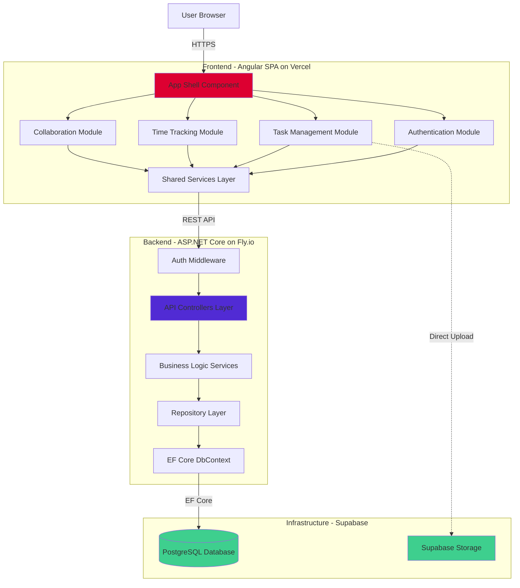

# Components

This section identifies the major logical components across the TaskFlow fullstack architecture, defining their responsibilities, interfaces, dependencies, and technology implementations. Components are organized into **Frontend Components** (Angular), **Backend Components** (ASP.NET Core), and **Infrastructure Components** (Supabase, Fly.io, Vercel).

**Component Architecture Principles:**
- **Single Responsibility:** Each component has one clear purpose with well-defined boundaries
- **Dependency Inversion:** Components depend on interfaces/abstractions, not concrete implementations
- **Layered Architecture:** Clear separation between presentation, business logic, and data access layers
- **Loose Coupling:** Components communicate via well-defined contracts (REST APIs, interfaces)
- **High Cohesion:** Related functionality grouped together within component boundaries

## Frontend Components (Angular SPA)

### AppShell Component

**Responsibility:** Root application component providing layout structure, navigation, authentication state management, and routing configuration. Handles application-wide concerns like error boundaries and global loading states.

**Key Interfaces:**
- `AppComponent` - Root component with router outlet and navigation shell
- `NavigationComponent` - Top navigation bar with user profile, logout, "My Tasks" toggle
- `SidebarComponent` - Left sidebar navigation for views (List, Tree, Timeline)
- `AuthGuard` - Route guard protecting authenticated routes

**Dependencies:**
- `AuthService` for authentication state (`isAuthenticated()`, `getCurrentUser()`)
- `Router` for navigation and route configuration
- Angular Material components for UI (MatToolbar, MatSidenav)

**Technology Stack:** Angular 20 standalone components, Angular Router, Angular Material 20, RxJS for reactive state

### Authentication Module

**Responsibility:** Handles user authentication flow including registration, login, logout, JWT token management, and HTTP request interception for adding authorization headers.

**Key Interfaces:**
- `LoginComponent` - Login form with email/password fields
- `RegisterComponent` - Registration form with validation
- `AuthService` - Service managing JWT tokens and user session
- `AuthInterceptor` - HTTP interceptor adding `Authorization: Bearer <token>` header
- `AuthGuard` - Prevents unauthenticated access to protected routes

**Dependencies:**
- `HttpClient` for API calls to `/api/auth/login`, `/api/auth/register`, `/api/auth/refresh`
- `Router` for navigation after login/logout
- `LocalStorage` for JWT token persistence

**Technology Stack:** Angular 20 reactive forms, Angular HttpClient with interceptors, RxJS BehaviorSubject for auth state, localStorage API

### Task Management Module

**Responsibility:** Core task CRUD operations including task list views (table, tree, Gantt), task creation/editing forms, task detail panels, filtering/sorting/searching, and drag-and-drop hierarchy management.

**Key Interfaces:**
- `TaskListComponent` - Data table view with sortable columns, filters, pagination
- `TaskTreeComponent` - Hierarchical tree view with expand/collapse and drag-and-drop
- `TaskGanttComponent` - Timeline/Gantt chart view with date-based rendering
- `TaskDetailComponent` - Slide-out panel showing full task details, comments, time log
- `TaskFormComponent` - Reusable form for create/edit with validation
- `TaskService` - HTTP service for task API operations

**Dependencies:**
- `TaskService` for API calls (`getTasks()`, `createTask()`, `updateTask()`, `deleteTask()`)
- `@circlon/angular-tree-component` or Angular Material Tree for tree view
- Gantt library (Frappe Gantt or custom SVG/D3.js implementation)
- Angular CDK Drag-Drop for reparenting

**Technology Stack:** Angular 20 components, Angular Material 20 (MatTable, MatPaginator, MatSort), Angular CDK, RxJS Observables, Angular Reactive Forms

### Time Tracking Module

**Responsibility:** Manages time tracking features including active timer UI, manual time entry forms, time log display, and timer state persistence across page refreshes.

**Key Interfaces:**
- `TimerWidgetComponent` - Floating/sticky timer display showing elapsed time
- `ManualTimeEntryComponent` - Form for logging past time with duration and notes
- `TimeLogComponent` - List of time entries for a task with user attribution
- `TimeTrackingService` - Service managing timer state and API operations

**Dependencies:**
- `TimeTrackingService` for API calls (`startTimer()`, `stopTimer()`, `logManualTime()`)
- `TaskService` for task context
- `LocalStorage` for persisting active timer state across refreshes
- Browser `setInterval()` for timer updates every second

**Technology Stack:** Angular 20 components, Angular Material 20 (MatDialog for time entry form), RxJS interval for timer ticks, localStorage for state persistence

### Collaboration Module

**Responsibility:** Team collaboration features including task assignments (user picker), comment threads with markdown support, activity log display, and user mentions.

**Key Interfaces:**
- `AssignmentPickerComponent` - User search/autocomplete for assigning tasks
- `CommentThreadComponent` - Display comment list with nested replies (post-MVP)
- `CommentFormComponent` - Textarea with markdown support and @mentions
- `ActivityLogComponent` - Timeline view of task changes with user attribution
- `CollaborationService` - HTTP service for comments and assignments

**Dependencies:**
- `CollaborationService` for API calls (`getComments()`, `createComment()`, `assignUser()`)
- `UserService` for user search (`searchUsers()`)
- Markdown library (ngx-markdown or marked.js) for comment rendering
- `AuthService` for current user context

**Technology Stack:** Angular 20 components, Angular Material 20 (MatAutocomplete, MatChip), RxJS, ngx-markdown for markdown rendering

### Shared Services Layer

**Responsibility:** Centralized HTTP services abstracting backend API communication, providing strongly-typed interfaces matching backend DTOs, handling errors, and managing loading states.

**Key Interfaces:**
- `AuthService` - Authentication operations (`login()`, `register()`, `logout()`, `refreshToken()`)
- `TaskService` - Task CRUD and hierarchy operations
- `TimeTrackingService` - Time entry operations
- `UserService` - User profile and search operations
- `CollaborationService` - Comments and assignments
- `ActivityLogService` - Activity history retrieval
- `HttpErrorInterceptor` - Global error handling for API failures

**Dependencies:**
- `HttpClient` for HTTP requests
- `AuthInterceptor` for adding JWT tokens
- RxJS operators for request transformation and error handling

**Technology Stack:** Angular 20 services (singleton via `providedIn: 'root'`), Angular HttpClient, RxJS Observables, TypeScript interfaces (auto-generated from C# DTOs via NSwag)

---

## Backend Components (ASP.NET Core API)

### API Controllers Layer

**Responsibility:** Exposes RESTful HTTP endpoints, handles request/response serialization, validates incoming data via model validation, enforces authorization, and delegates business logic to service layer.

**Key Interfaces:**
- `AuthController` - `/api/auth/*` endpoints (register, login, refresh)
- `UsersController` - `/api/users/*` endpoints (profile management, search)
- `TasksController` - `/api/tasks/*` endpoints (CRUD, hierarchy, assignments)
- `TimeEntriesController` - `/api/timeentries/*` endpoints (create, update, delete, active timer)
- `CommentsController` - `/api/comments/*` endpoints (create, update, delete)
- `ActivityLogsController` - `/api/tasks/{id}/activities` endpoint

**Dependencies:**
- Service layer interfaces (`ITaskService`, `IUserService`, `ITimeTrackingService`, `ICommentService`)
- ASP.NET Core Identity for authentication context (`User.FindFirst(ClaimTypes.NameIdentifier)`)
- ASP.NET Core Model Validation for request DTO validation
- Swashbuckle for OpenAPI documentation generation

**Technology Stack:** ASP.NET Core 8.0 Web API controllers, attribute routing, model binding, `[Authorize]` attribute for JWT validation, async/await pattern

### Business Logic (Service Layer)

**Responsibility:** Encapsulates domain business logic, orchestrates repository operations, enforces business rules (circular reference prevention, depth limits), calculates derived values (parent progress, time rollup), and manages transactions.

**Key Interfaces:**
- `IUserService` / `UserService` - User management, password hashing, profile updates
- `ITaskService` / `TaskService` - Task CRUD, hierarchy validation, assignment management
- `ITimeTrackingService` / `TimeTrackingService` - Time entry logic, duration calculations, rollup aggregation
- `ICommentService` / `CommentService` - Comment creation, edit permissions, soft delete
- `IActivityLogService` / `ActivityLogService` - Activity event creation, description formatting

**Dependencies:**
- Repository interfaces (`ITaskRepository`, `IUserRepository`, `ITimeEntryRepository`, `ICommentRepository`)
- `IUnitOfWork` for transaction management
- ASP.NET Core Identity `UserManager` and `SignInManager` for user operations
- AutoMapper for DTO-to-entity mapping

**Technology Stack:** C# 12 with async/await, dependency injection, LINQ queries, business logic validation, transaction management via Unit of Work pattern

### Data Access (Repository Layer)

**Responsibility:** Abstracts database access via Entity Framework Core, provides generic CRUD operations, implements specialized queries (recursive CTEs, full-text search, complex filters), and handles database transactions.

**Key Interfaces:**
- `IRepository<T>` - Generic repository with CRUD operations (`GetById`, `Add`, `Update`, `Delete`, `Find`)
- `ITaskRepository` - Specialized task queries (`GetHierarchy`, `GetDescendants`, `GetByFilters`)
- `IUserRepository` - User queries (`GetByEmail`, `SearchUsers`)
- `ITimeEntryRepository` - Time queries (`GetTaskTimeEntries`, `GetActiveTimer`)
- `ICommentRepository` - Comment queries (`GetTaskComments`)
- `IActivityLogRepository` - Activity queries with pagination
- `IUnitOfWork` - Transaction management with `SaveChangesAsync()`

**Dependencies:**
- `ApplicationDbContext` - EF Core DbContext with entity configurations
- Entity Framework Core 8.0 for ORM operations
- PostgreSQL provider (`Npgsql.EntityFrameworkCore.PostgreSQL`)

**Technology Stack:** Entity Framework Core 8.0, LINQ-to-SQL, async queries, DbContext with dependency injection, repository pattern, unit of work pattern

### Database Context (ApplicationDbContext)

**Responsibility:** Entity Framework Core DbContext managing database connection, entity configurations, migrations, change tracking, and SQL query generation.

**Key Interfaces:**
- `ApplicationDbContext` - DbContext with DbSet properties for each entity
- `DbSet<User>`, `DbSet<Task>`, `DbSet<TimeEntry>`, `DbSet<Comment>`, `DbSet<TaskAssignee>`, `DbSet<ActivityLog>`
- Entity configurations via Fluent API (`OnModelCreating`)
- Migration history tracking

**Dependencies:**
- PostgreSQL database connection string (from configuration)
- Entity class definitions (User, Task, TimeEntry, Comment, TaskAssignee, ActivityLog)
- EF Core migrations for schema versioning

**Technology Stack:** Entity Framework Core 8.0, Fluent API for entity configuration, code-first migrations, PostgreSQL provider, connection pooling

### Authentication & Authorization Middleware

**Responsibility:** Validates JWT bearer tokens, extracts user identity from claims, enforces authorization policies, handles token refresh, and provides user context to controllers/services.

**Key Interfaces:**
- `JwtBearerMiddleware` - ASP.NET Core JWT authentication middleware
- `AuthorizationMiddleware` - Role/policy-based authorization
- `JwtTokenService` - Token generation and validation utility
- `RefreshTokenRepository` - Refresh token storage and validation

**Dependencies:**
- ASP.NET Core Identity for user management
- `JwtSecurityTokenHandler` for token generation/validation
- Configuration for JWT secret key, issuer, audience

**Technology Stack:** ASP.NET Core Identity 8.0, JWT bearer authentication, bcrypt password hashing (via Identity), refresh token pattern with database storage

---

## Infrastructure Components

### Vercel Edge Network (Frontend Hosting)

**Responsibility:** Serves static Angular build artifacts (HTML, CSS, JS bundles) with global CDN distribution, provides automatic HTTPS, handles routing for Angular SPA, and enables instant deployments from Git.

**Key Interfaces:**
- Static file serving at `https://taskflow.vercel.app`
- Environment variable injection for API endpoint configuration
- Build hooks for automatic deployment on Git push
- Analytics and Web Vitals monitoring

**Dependencies:**
- GitHub repository for source code and CI/CD triggers
- Angular CLI production build output (`ng build --configuration production`)

**Technology Stack:** Vercel platform, global edge network, automatic HTTPS, Git-based deployments, serverless functions (not used in TaskFlow)

### Fly.io Container Platform (Backend Hosting)

**Responsibility:** Hosts ASP.NET Core API in Docker containers, provides persistent volumes for any local state, manages multi-region deployment, automatic HTTPS via Fly Proxy, health checks, and horizontal scaling.

**Key Interfaces:**
- API accessible at `https://api.taskflow.fly.dev`
- Fly.io CLI for deployment (`fly deploy`)
- `fly.toml` configuration for app settings (regions, scaling, health checks)
- Dockerfile for .NET API containerization

**Dependencies:**
- Docker for containerization
- ASP.NET Core 8.0 runtime
- Connection to Supabase PostgreSQL

**Technology Stack:** Fly.io platform, Docker 24+, multi-region deployment (iad primary), automatic TLS, container orchestration, health monitoring

### Supabase PostgreSQL Database

**Responsibility:** Provides managed PostgreSQL 15+ database with recursive CTE support, full-text search, ACID transactions, automated backups, connection pooling, and row-level security (RLS) for direct client access if needed.

**Key Interfaces:**
- PostgreSQL connection string with credentials
- Database migrations via EF Core (`dotnet ef migrations add`, `dotnet ef database update`)
- Direct SQL access for recursive CTEs
- Supabase Studio for database management UI

**Dependencies:**
- Entity Framework Core 8.0 with Npgsql provider
- Database schema defined via EF Core entities

**Technology Stack:** Supabase platform, PostgreSQL 15+, pgvector extension (post-MVP for semantic search), automated backups, connection pooling

### Supabase Storage (File Storage)

**Responsibility:** Stores user profile images with signed URL access, supports direct client uploads from Angular, provides image transformations, and enforces row-level security policies.

**Key Interfaces:**
- Storage bucket: `avatars`
- Upload endpoint for Angular HttpClient
- Signed URL generation for secure access
- RLS policies limiting access to authenticated users

**Dependencies:**
- Supabase JavaScript client (used from Angular if direct upload)
- Or backend proxy for uploads via ASP.NET Core

**Technology Stack:** Supabase Storage (S3-compatible), signed URLs, image transformation CDN, RLS for access control

---

## Component Interaction Diagram

## Component Communication Patterns

**Frontend to Backend:**
- **Protocol:** HTTPS REST API with JSON payloads
- **Authentication:** JWT bearer token in `Authorization` header
- **Error Handling:** HTTP status codes with standardized error response format
- **Loading States:** RxJS Observable streams with loading/error/success states
- **Polling:** HTTP polling at 30-second intervals for activity log updates

**Backend Internal:**
- **Controller → Service:** Dependency injection, async/await method calls
- **Service → Repository:** Interface-based calls with Unit of Work for transactions
- **Repository → Database:** Entity Framework Core LINQ queries, compiled to SQL
- **Cross-Cutting Concerns:** Middleware pipeline (auth, logging, error handling)

**Database Access:**
- **Standard Queries:** EF Core LINQ with automatic SQL generation
- **Recursive Queries:** Raw SQL with `FromSqlRaw()` for WITH RECURSIVE CTEs
- **Transactions:** Unit of Work pattern with `SaveChangesAsync()` commit boundary

**File Storage:**
- **Profile Images:** Direct upload from Angular to Supabase Storage (post-MVP), or proxy through .NET API for consistency

