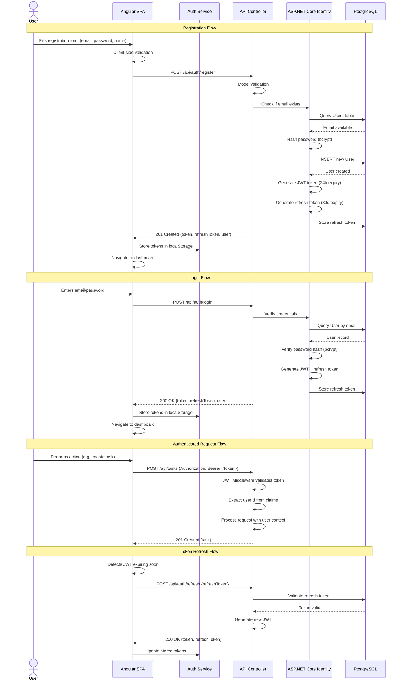
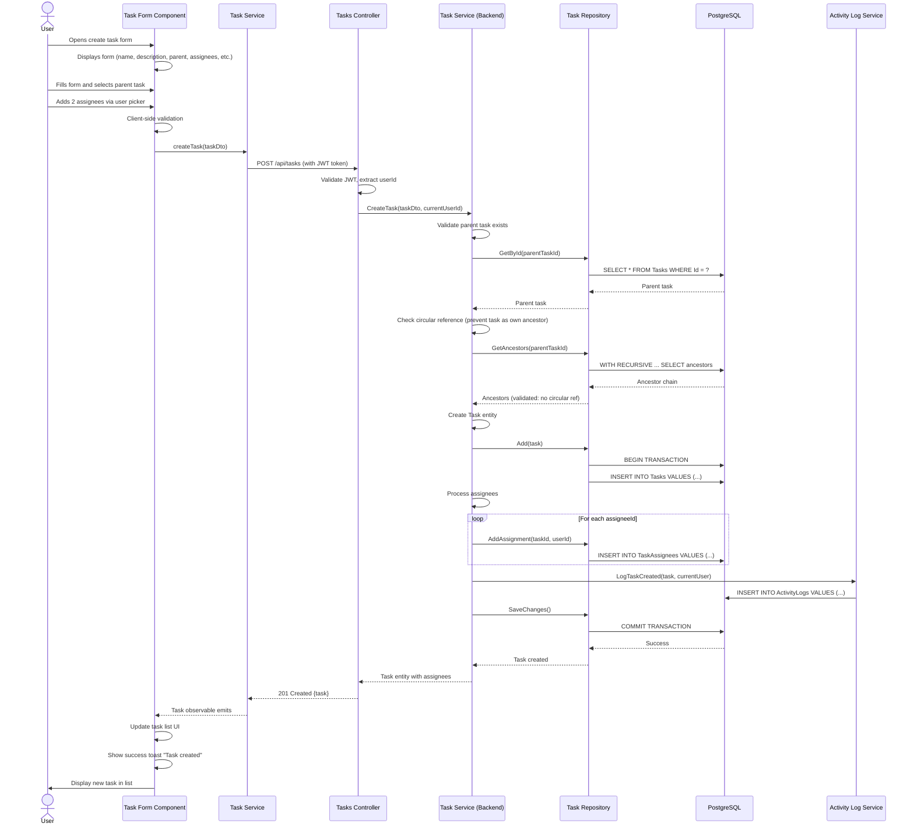
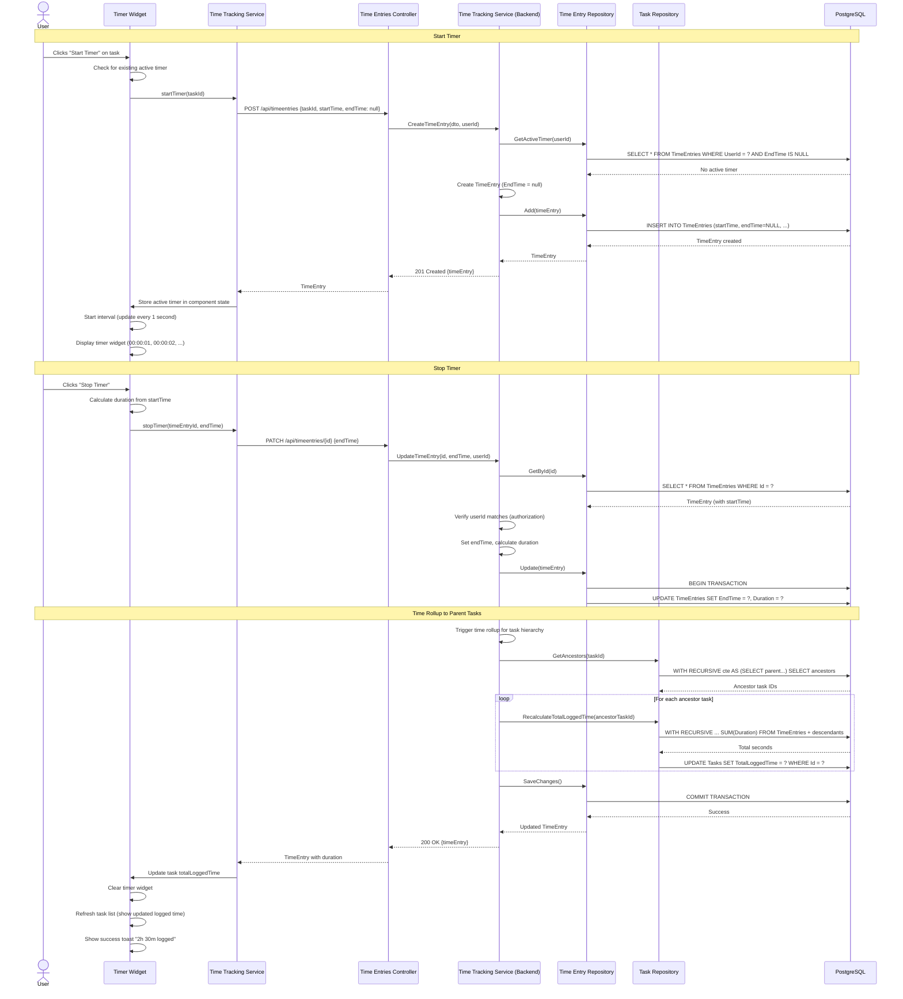
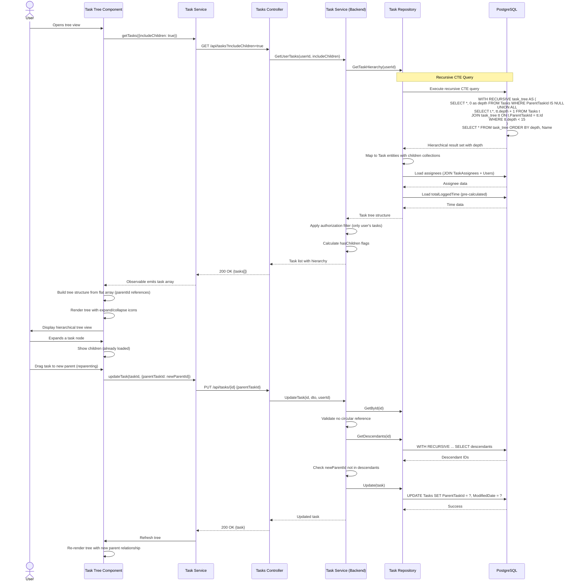
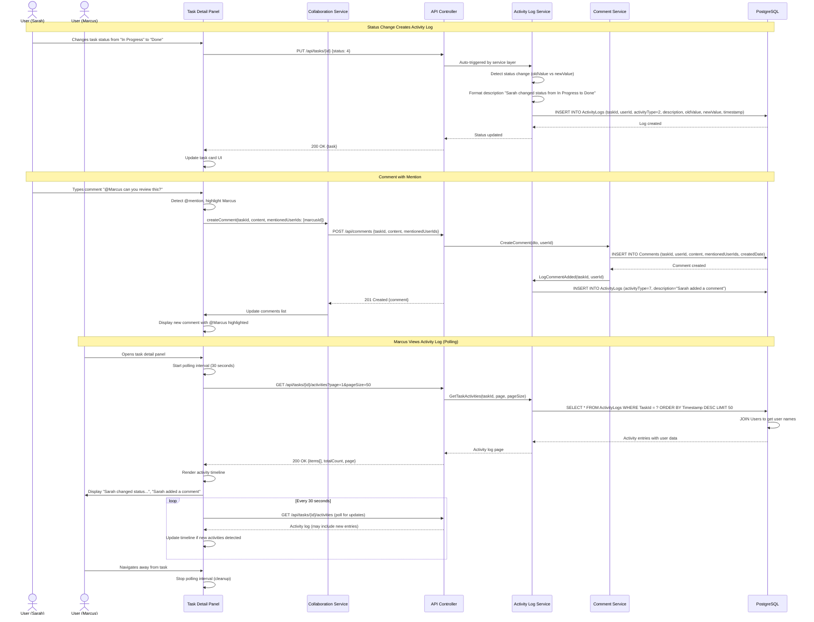
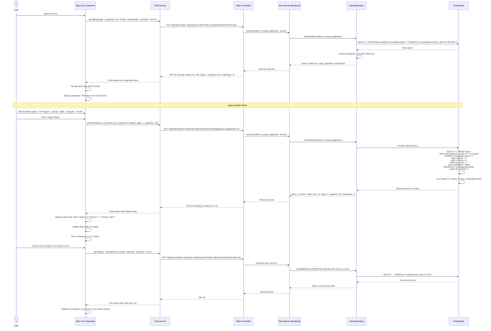

# Core Workflows

This section illustrates the key system workflows using sequence diagrams, showing how frontend components, backend services, and infrastructure interact to fulfill critical user journeys from the PRD.

## User Registration and Authentication Flow

## Task Creation with Hierarchy and Assignment

## Time Tracking: Start Timer → Stop Timer → Time Rollup

## Hierarchical Task Query with Recursive CTE

## Activity Log and Collaboration Flow

## Advanced Filtering and Sorting Flow

**Workflow Summary:**

These core workflows demonstrate:
1. **Authentication Flow:** JWT-based auth with bcrypt password hashing (NFR10), refresh token pattern (NFR9)
2. **Task Creation:** Circular reference prevention, validation, multi-user assignment, activity logging
3. **Time Tracking:** Active timer with localStorage persistence, time rollup via recursive CTE (NFR19)
4. **Hierarchy Queries:** PostgreSQL recursive CTEs for efficient tree traversal (NFR19)
5. **Collaboration:** Activity log generation, comment system with mentions, HTTP polling for updates
6. **Advanced Filtering:** Complex multi-criteria queries with proper indexing, pagination (NFR2 <500ms)

All workflows follow the established architectural patterns: three-tier architecture, JWT authentication, EF Core with repositories, HTTP polling for live updates, and recursive CTEs for hierarchical data.

