# High Level Architecture

## Technical Summary

TaskFlow implements a **traditional three-tier architecture** with an Angular single-page application frontend, ASP.NET Core Web API backend hosted on Fly.io, and Supabase PostgreSQL as the database layer. The architecture leverages **PostgreSQL's relational model** with Entity Framework Core for ORM, recursive Common Table Expressions (CTEs) for hierarchical task queries (NFR19), and ASP.NET Core Identity for authentication (NFR10). Angular's standalone component architecture provides code-splitting and lazy loading for optimal performance, while Vercel delivers the SPA with global edge network distribution and automatic HTTPS.

Key integration points include:
- **Frontend-Backend**: Angular communicates via HTTP REST API with strongly-typed TypeScript interfaces generated from C# models
- **Authentication Flow**: ASP.NET Core Identity with JWT bearer tokens (FR1), bcrypt password hashing (NFR10), refresh token pattern (NFR9)
- **Live Updates**: HTTP polling for activity log updates (FR22), client-side timer for time tracking (FR10)
- **File Storage**: Supabase Storage for user profile images with direct client uploads
- **Data Access**: Entity Framework Core with strongly-typed LINQ queries, migrations, and change tracking

This architecture achieves PRD goals by providing full control over business logic, SQL-based hierarchy queries (NFR19), ASP.NET Core Identity compliance (NFR10), sub-second UI responsiveness (NFR1-4), progressive web app capabilities (NFR7), and true zero-cost hosting within generous free tiers (NFR18, NFR20).

## Platform and Infrastructure Choice

Based on requirements analysis, here are the top platform options:

**Option 1: Vercel + Fly.io + Supabase (Recommended)**
- **Pros**: Full .NET backend control (ASP.NET Core), Entity Framework Core ORM, PostgreSQL with recursive CTEs (NFR19), ASP.NET Core Identity (NFR10), generous free tiers across all platforms, Docker deployment, complete business logic flexibility
- **Cons**: Three separate services to manage, need to write API endpoints manually (no auto-generation), requires backend deployment pipeline
- **Cost**: $0/month for MVP (all free tiers), ~$25-50/month at 10K+ users (Supabase Pro + Fly.io scaling)
- **Best For**: Traditional N-tier applications requiring full backend control and complex business logic

**Option 2: Firebase**
- **Pros**: Integrated services, real-time database, automatic scaling, zero DevOps overhead, excellent Angular integration via AngularFire
- **Cons**: Severe vendor lock-in, per-read billing trap (50K reads/day free = ~5-10 page loads per user), NoSQL requires denormalization, violates NFR19 (no recursive CTEs), costs explode at scale
- **Cost**: $0/month for MVP, ~$500-900/month at 1000 active users (real-time multiplies reads)
- **Best For**: Prototypes and demos where cost/lock-in don't matter

**Option 3: AWS (Amplify + RDS + Cognito)**
- **Pros**: Enterprise-grade scalability, comprehensive service ecosystem, fine-grained control
- **Cons**: Steep learning curve, complex pricing model, significant DevOps overhead, free tier expires after 12 months, RDS minimum ~$15/month
- **Cost**: $30-50/month even at MVP scale
- **Best For**: Enterprise applications with dedicated DevOps resources

**Recommendation: Vercel + Fly.io + Supabase**

**Rationale:** This traditional architecture provides maximum control and explicitly fulfills PRD requirements: NFR19 (recursive CTEs via Entity Framework Core), NFR10 (ASP.NET Core Identity with bcrypt), NFR11 (parameterized queries via EF Core), and NFR20 (zero licensing costs). A .NET backend enables complex business logic for FR6 (recursive time aggregation), FR13 (time rollup calculations), and future features without being constrained by database-generated APIs. Entity Framework Core provides type-safe database access with migrations, LINQ queries, and change tracking. All three platforms offer generous free tiers supporting MVP scale. The architecture follows familiar patterns that accelerate AI-assisted development and developer onboarding. SignalR provides robust real-time capabilities for collaborative features. Docker deployment on Fly.io ensures portability—can migrate to any container host without vendor lock-in.

**Platform:** Vercel (frontend) + Fly.io (backend API) + Supabase (database)

**Key Services:**
- **ASP.NET Core Web API**: RESTful API with controllers, middleware, dependency injection, hosted on Fly.io Docker containers
- **Entity Framework Core**: ORM for type-safe database access, migrations, LINQ queries, change tracking
- **ASP.NET Core Identity**: Authentication with JWT bearer tokens, bcrypt password hashing (NFR10), refresh tokens (NFR9)
- **Supabase PostgreSQL**: Relational database with recursive CTEs, full-text search, ACID transactions
- **Supabase Storage**: User profile image storage with direct client uploads
- **Fly.io**: Docker container hosting with global deployment, persistent volumes, automatic HTTPS
- **Vercel**: Angular SPA hosting with global edge network, automatic deployments from Git

**Deployment Host and Regions:** Vercel (global edge network), Fly.io (multi-region: iad=primary, lax, fra), Supabase (us-east-1)

## Repository Structure

**Structure:** Monorepo with workspace-based organization

**Rationale:** A hybrid repository structure separates frontend (npm/Angular) and backend (.NET/C#) while maintaining clear organization. The Angular app remains in the current workspace, while the .NET API lives as a sibling .NET solution. This approach respects each ecosystem's conventions (package.json vs .csproj) while enabling shared contracts via TypeScript interfaces generated from C# DTOs. Docker Compose orchestrates local development with all services running together.

**Repository Tool:** Polyglot monorepo (npm workspace + .NET solution)

**Repository Organization:**
```
taskflow/
├── frontend/                # Angular workspace
│   ├── src/
│   │   ├── app/
│   │   ├── environments/
│   │   └── assets/
│   ├── angular.json
│   ├── package.json
│   └── tsconfig.json
├── backend/                 # .NET solution
│   ├── TaskFlow.Api/        # ASP.NET Core Web API
│   │   ├── Controllers/
│   │   ├── Middleware/
│   │   ├── Program.cs
│   │   ├── Dockerfile
│   │   └── TaskFlow.Api.csproj
│   ├── TaskFlow.Core/       # Domain models, interfaces
│   │   ├── Entities/        # Task, User, TimeEntry, Comment
│   │   ├── Interfaces/      # ITaskRepository, IUserService
│   │   └── TaskFlow.Core.csproj
│   ├── TaskFlow.Infrastructure/  # EF Core, repositories
│   │   ├── Data/
│   │   │   ├── ApplicationDbContext.cs
│   │   │   └── Migrations/
│   │   ├── Repositories/
│   │   └── TaskFlow.Infrastructure.csproj
│   ├── TaskFlow.Tests/      # Unit and integration tests
│   │   └── TaskFlow.Tests.csproj
│   └── TaskFlow.sln         # Solution file
├── shared/                  # Shared contracts
│   └── models/              # TypeScript interfaces from C# DTOs
├── docker-compose.yml       # Local development orchestration
├── .github/workflows/       # CI/CD pipelines
│   ├── frontend.yml         # Vercel deployment
│   └── backend.yml          # Fly.io deployment
└── README.md
```

**Migration Path:** Create `backend/` directory with new ASP.NET Core Web API solution. Migrate current Angular project into `frontend/` directory. Configure EF Core with Supabase PostgreSQL connection. Generate TypeScript interfaces from C# DTOs using tools like NSwag or TypeScript Generator. Set up Docker for local development and Fly.io deployment. This can be done incrementally—start with auth endpoints, then migrate features progressively.

## High Level Architecture Diagram

```mermaid
graph TB
    User[User Browser]
    
    subgraph "Vercel Platform"
        Vercel[Vercel Edge Network<br/>Global CDN]
    end
    
    subgraph "Fly.io Platform"
        FlyProxy[Fly Proxy<br/>Load Balancer]
        ApiContainer[.NET API Container<br/>ASP.NET Core]
    end
    
    subgraph "Supabase Platform"
        Postgres[(PostgreSQL Database<br/>Tasks, Users, TimeEntries)]
        Storage[Supabase Storage<br/>Profile Images]
    end
    
    subgraph "Angular SPA"
        Router[Angular Router]
        Components[Components]
        HttpClient[HTTP Client Services]
        Guards[Auth Guards]
    end
    
    User -->|HTTPS| Vercel
    Vercel -->|Delivers SPA| Router
    Router --> Components
    Components --> HttpClient
    HttpClient -->|REST API| FlyProxy
    FlyProxy --> ApiContainer
    ApiContainer -->|EF Core| Postgres
    Components -->|Direct Upload| Storage
    Guards -.->|Validates JWT| HttpClient
    
    style Vercel fill:#000000
    style FlyProxy fill:#7c3aed
    style ApiContainer fill:#512bd4
    style Postgres fill:#3ECF8E
    style Storage fill:#3ECF8E
```



## Architectural Patterns

- **Three-Tier Architecture:** Presentation (Angular), Business Logic (.NET API), Data (PostgreSQL) with clear separation - _Rationale:_ Proven architecture pattern, optimal for NFR requirements, enables independent scaling of tiers, familiar to developers

- **Component-Based UI (Standalone Components):** Angular 17+ standalone components with explicit dependency injection - _Rationale:_ Improved tree-shaking, faster build times, and clearer component boundaries for AI-driven development

- **Smart/Container Pattern:** Presentation components (dumb) separated from container components (smart) that handle HTTP service calls - _Rationale:_ Enhanced testability, reusability, and clear separation of concerns

- **Reactive State Management:** RxJS Observables with HttpClient and periodic polling for live updates - _Rationale:_ Handles activity log updates (FR22) via polling intervals, client-side timer for time tracking (FR10), leverages Angular's change detection efficiently

- **API Service Layer (Frontend):** TypeScript services abstract HTTP operations behind domain-specific interfaces - _Rationale:_ Clean separation of concerns, simplifies testing with mock services, provides clear API contracts matching backend DTOs

- **Optimistic UI Updates:** UI updates immediately, synchronizes with .NET API asynchronously - _Rationale:_ Meets NFR4 (<100ms UI latency) for time tracking timer, improves perceived performance

- **Normalized Relational Data Model:** Standard SQL normalization (3NF) with Entity Framework Core navigation properties - _Rationale:_ Eliminates data duplication, ensures referential integrity via ACID transactions, enables powerful LINQ queries and eager/lazy loading

- **Clean Architecture (Onion):** Core domain layer, infrastructure layer, API layer with dependency inversion - _Rationale:_ Testable business logic, framework independence, clear separation of concerns, enables AI-assisted feature development

- **Repository Pattern with Unit of Work:** Abstracted data access via generic repositories and DbContext transactions - _Rationale:_ Enables testing with in-memory databases, encapsulates EF Core complexity, provides clear data access contracts

- **Entity Framework Core ORM:** Code-first migrations, LINQ queries, change tracking, lazy loading - _Rationale:_ Type-safe database access (NFR11), automatic SQL generation, seamless relationship navigation, strongly-typed entities

- **JWT Bearer Authentication:** ASP.NET Core Identity with JWT tokens and refresh token pattern - _Rationale:_ Directly fulfills NFR9 and NFR10, stateless authentication, bcrypt password hashing, industry-standard security

- **HTTP Polling for Live Updates:** Periodic GET requests for activity log changes and task updates - _Rationale:_ Simpler than WebSockets, stateless scaling, sufficient for FR22 (activity logs) given TaskFlow's usage patterns (3-7 person teams, not simultaneous editing)

- **Recursive CTEs via Raw SQL:** EF Core FromSqlRaw with PostgreSQL WITH RECURSIVE queries - _Rationale:_ Directly fulfills NFR19, enables efficient hierarchy traversal in database, map results to strongly-typed entities

- **Progressive Web App (PWA):** Service worker for offline capability and app-like experience - _Rationale:_ Meets NFR7 requirements, enables add-to-home-screen functionality, improves reliability on unstable connections

