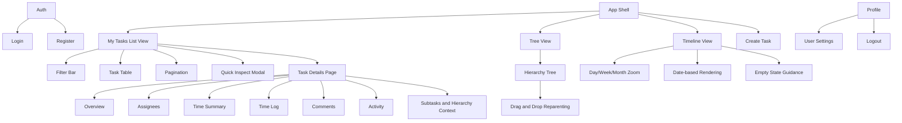
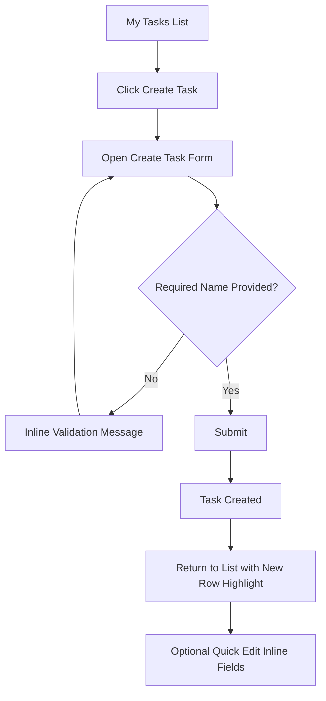
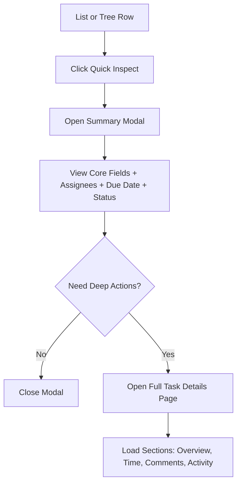
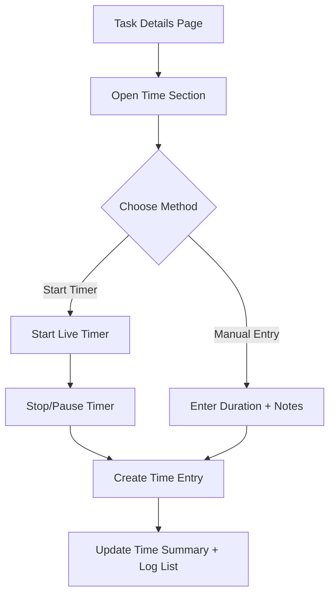
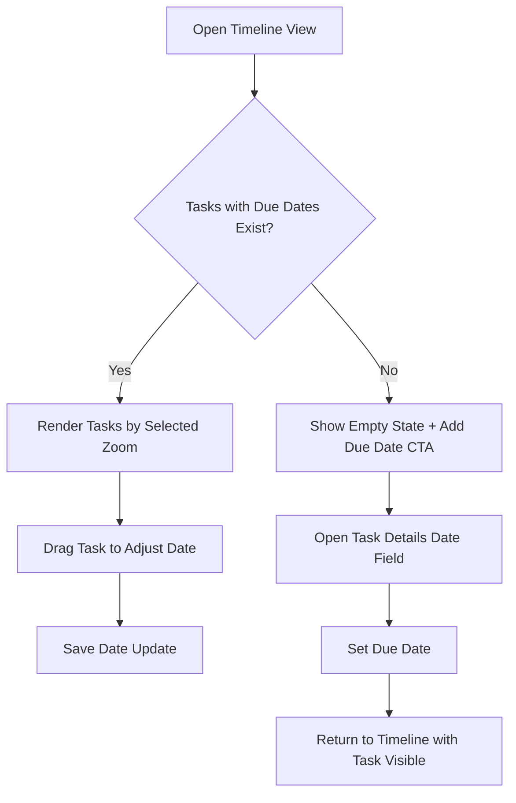

# TaskFlow UI/UX Specification

## Introduction

This document defines the user experience goals, information architecture, user flows, and visual design specifications for TaskFlow's user interface. It serves as the foundation for visual design and frontend development, ensuring a cohesive and user-centered experience.

### Overall UX Goals & Principles

#### Target User Personas

- **Freelance Sarah (Primary):** Independent consultant managing multiple client tasks, billing by time, needs low-friction task capture plus reliable timer plus fast list filtering.
- **Team Lead Marcus (Primary):** Leads a 3-7 person team, needs hierarchy visibility, assignment clarity, timeline planning, and status transparency.
- **Occasional Collaborator (Secondary):** Team member who updates assigned work quickly and values clear status updates, due-date visibility, and minimal navigation overhead.

#### Usability Goals

- New users create first task and start timer in under 5 minutes.
- Frequent users perform core actions (find task, update status, log time) in three or fewer interactions from list view.
- Users can understand task state at a glance through consistent status and priority visuals with minimal cognitive load.
- Timeline view clearly communicates why it is empty and how to populate it (due-date guidance), reducing dead-end states.
- Task detail panel keeps primary actions visible without deep scrolling.

#### Design Principles

1. **Clarity over density** - prioritize scanability and readable spacing over fitting maximum data per screen.
2. **Progressive disclosure** - show essential controls first and keep advanced filters/settings collapsible.
3. **Action proximity** - place high-frequency actions near the data they affect (status, timer, quick edit).
4. **Consistent feedback** - every user action yields immediate, understandable visual response.
5. **Accessible by default** - WCAG AA contrast, visible focus, keyboard support, and touch target minimums.

### Change Log

| Date | Version | Description | Author |
|------|---------|-------------|--------|
| 2026-02-22 | v0.1 | Initial UI/UX specification draft created | Sally (UX Expert) |

## Information Architecture (IA)

### Site Map / Screen Inventory

### Navigation Structure

**Primary Navigation:**  
Top-level views: My Tasks (List), Tree, Timeline, and Create Task. Default landing view remains My Tasks List for fastest task operations.

**Secondary Navigation:**  
Within list and tree views, quick actions include open quick modal for lightweight preview and open details page for full management. Inside Task Details page, information is structured into clear sections (Overview, Time, Comments, Activity) to reduce scroll fatigue.

**Breadcrumb Strategy:**  
Dedicated Task Details page uses hierarchical breadcrumbs for nested tasks (e.g., Parent > Child > Subtask). Quick Inspect Modal intentionally avoids deep navigation and shows summary-only content with a single "Open full details" action.

## User Flows

### Create Task from List View

**User Goal:** Quickly create a new task with enough metadata to start work.  
**Entry Points:** Create Task button (list header), keyboard shortcut (future), empty state CTA.  
**Success Criteria:** Task appears in list immediately, with editable status/priority/due date.

**Edge Cases & Error Handling:**
- API failure on save shows inline error with retry.
- Duplicate rapid submits are debounced and button disabled during submit.
- Missing required fields are announced accessibly and focused.

**Notes:** Keep form minimal by default; advanced fields are expandable.

### Quick Inspect Modal to Full Details Page

**User Goal:** Inspect task summary quickly, then escalate to full details when needed.  
**Entry Points:** Eye icon / row action from list or tree.  
**Success Criteria:** Users can read key info in modal and open full task page in one action.

**Edge Cases & Error Handling:**
- Partial load failure (e.g., comments) shows section-level error with retry.
- Modal content loading skeleton prevents blank flash.
- Escape key closes modal and returns focus to originating row action.

**Notes:** Modal is intentionally non-comprehensive; no deep editing inside modal.

### Manage Time from Task Details Page

**User Goal:** Start/stop timer or add manual log without leaving task context.  
**Entry Points:** Task Details page Time section, optional quick action in list row.  
**Success Criteria:** Time entry is recorded, reflected in task totals, and visible in log history.

**Edge Cases & Error Handling:**
- Lost connection while timer running triggers reconnect notice and local elapsed preservation.
- Invalid manual duration blocked with clear validation.
- Concurrent timer conflict warns user and offers switch/stop options.

**Notes:** Keep timer controls persistent and high visibility in details page layout.

### Timeline Planning and Empty-State Recovery

**User Goal:** Plan work by date and quickly understand missing scheduling data.  
**Entry Points:** Timeline tab with Day/Week/Month toggles.  
**Success Criteria:** Dated tasks render correctly; empty state gives direct action.

**Edge Cases & Error Handling:**
- Date update conflict resolved with latest-server-value prompt.
- Invalid date ranges blocked with explanation.
- Timeline render timeout shows fallback guidance and retry.

**Notes:** Empty-state CTA is mandatory to prevent dead-end experience.

## Wireframes & Mockups

**Primary Design Files:** Initial low-fidelity specs in this document; high-fidelity source to be created in Figma (link to be added).

### Key Screen Layouts

#### My Tasks - List View

**Purpose:** High-efficiency task triage and editing hub.

**Key Elements:**
- Compact top bar: page title, view switcher, primary Create Task action.
- Simplified default filter row (Search plus Status), expandable advanced filters.
- Data table with readable row height, sticky actions column, pagination.

**Interaction Notes:** Row click opens Quick Inspect modal; dedicated action opens full Task Details page.

**Design File Reference:** Figma frame TBD (List View v1).

#### Quick Inspect Modal

**Purpose:** Fast summary preview without navigation context loss.

**Key Elements:**
- Header with task title, status chip, close action.
- Summary block: due date, priority, assignees, short description.
- Footer action: Open full details.

**Interaction Notes:** No deep editing; Escape closes and restores focus to invoking control.

**Design File Reference:** Figma frame TBD (Quick Inspect v1).

#### Task Details Page

**Purpose:** Full task management for information-dense workflows.

**Key Elements:**
- Breadcrumb plus title area with primary actions (Edit, Start/Stop Timer).
- Sectioned content: Overview, Time, Comments, Activity, Subtasks context.
- Right rail (desktop) for status, priority, due date quick controls.

**Interaction Notes:** Supports deep edits, manual time logs, comment operations, and activity review.

**Design File Reference:** Figma frame TBD (Task Details v1).

#### Timeline View

**Purpose:** Date-based planning and schedule adjustment.

**Key Elements:**
- Day/Week/Month toggle with clear selected state.
- Timeline canvas with dated tasks.
- Empty-state panel with Add due date CTA.

**Interaction Notes:** Drag adjusts due dates; failures show inline retry and conflict messaging.

**Design File Reference:** Figma frame TBD (Timeline v1).

## Component Library / Design System

**Design System Approach:** Use PrimeNG + Material Design 3-aligned tokens as the base system, with a thin TaskFlow usage layer that defines spacing, hierarchy, and interaction rules.

### Core Components

#### App Header

**Purpose:** Global orientation and account actions.

**Variants:** Authenticated, unauthenticated.

**States:** Default, scrolled, loading user profile.

**Usage Guidelines:** Keep header stable and avoid task-specific controls here.

#### View Switcher (List / Tree / Timeline)

**Purpose:** Switch between task representations while preserving context.

**Variants:** Segmented control (desktop), dropdown fallback (mobile).

**States:** Default, selected, disabled, keyboard-focused.

**Usage Guidelines:** Preserve active filters and selected project scope across switches.

#### Filter Bar

**Purpose:** Fast narrowing of task list.

**Variants:** Collapsed (default), expanded advanced filters.

**States:** Default, active filters, loading options, validation error.

**Usage Guidelines:** Show Search + Status by default and expose advanced fields on demand.

#### Task Data Table

**Purpose:** High-density but readable task browsing/editing.

**Variants:** Standard, compact (optional for power users later).

**States:** Loading skeleton, populated, empty, error, row selected.

**Usage Guidelines:** Keep row actions right-aligned and enable inline edits for lightweight fields only.

#### Quick Inspect Modal

**Purpose:** Lightweight summary inspection.

**Variants:** Standard summary modal only.

**States:** Loading, loaded, partial-content error, close.

**Usage Guidelines:** No deep forms inside; always provide Open full details.

#### Task Details Page Sections

**Purpose:** Manage full task lifecycle in one destination.

**Variants:** Overview, Time, Comments, Activity, Subtasks context.

**States:** Section loading, section error with retry, ready, editing.

**Usage Guidelines:** Keep primary task actions persistent near page header.

#### Status & Priority Chips

**Purpose:** Visual state communication at a glance.

**Variants:** Status (To Do, In Progress, Blocked, Waiting, Done), Priority (Low/Medium/High/Critical).

**States:** Default, hover, selected (filter context), disabled.

**Usage Guidelines:** Use consistent color-semantic mapping across list, modal, details, and timeline.

#### Toast / Inline Feedback

**Purpose:** Communicate outcomes, errors, and retries.

**Variants:** Success, warning, error, info.

**States:** Timed dismiss, manual dismiss, action-required (with Retry).

**Usage Guidelines:** Error toasts for failed loads must include contextual retry where possible.

## Branding & Style Guide

### Visual Identity

**Brand Guidelines:** Use TaskFlow's existing minimalist productivity identity with PrimeNG/Material defaults; avoid bespoke brand effects that increase UI noise.

### Color Palette

| Color Type | Hex Code | Usage |
|---|---|---|
| Primary | #3F51B5 | Primary actions, active navigation, key selection states |
| Secondary | #5C6BC0 | Supporting actions, secondary emphasis states |
| Accent | #42A5F5 | Informational highlights, links, interactive cues |
| Success | #2E7D32 | Positive feedback, done states, confirmations |
| Warning | #ED6C02 | Cautions, pending attention, in-progress warnings |
| Error | #D32F2F | Errors, destructive actions, blocked state emphasis |
| Neutral | #F5F5F5 / #E0E0E0 / #757575 / #333333 | Backgrounds, borders, muted labels, primary text |

### Typography

#### Font Families

- **Primary:** System UI stack (Segoe UI, San Francisco, Roboto, Arial, sans-serif)
- **Secondary:** Same as primary (single-family strategy for consistency/performance)
- **Monospace:** ui-monospace, SFMono-Regular, Consolas, monospace

#### Type Scale

| Element | Size | Weight | Line Height |
|---|---|---|---|
| H1 | 32px | 600 | 40px |
| H2 | 24px | 600 | 32px |
| H3 | 20px | 600 | 28px |
| Body | 14px | 400 | 22px |
| Small | 12px | 400 | 18px |

### Iconography

**Icon Library:** PrimeIcons / Material Icons (single library per screen, avoid mixing styles in one context).

**Usage Guidelines:** Icon + label for ambiguous actions; icon-only allowed for common row actions with tooltip and ARIA label.

### Spacing & Layout

**Grid System:** 12-column desktop grid, 8-column tablet, 4-column mobile.

**Spacing Scale:** 4, 8, 12, 16, 24, 32 px; default control vertical rhythm on 8 px increments.

## Accessibility Requirements

### Compliance Target

**Standard:** WCAG 2.2 AA

### Key Requirements

**Visual:**
- Color contrast ratios: minimum 4.5:1 for normal text, 3:1 for large text and UI component boundaries.
- Focus indicators: persistent, high-contrast visible focus ring on all interactive elements; never removed via CSS reset.
- Text sizing: support zoom to 200% without loss of core functionality; respect user font scaling.

**Interaction:**
- Keyboard navigation: all controls reachable via Tab/Shift+Tab; Enter/Space activation; Escape closes modal; logical focus return to trigger.
- Screen reader support: semantic landmarks, descriptive labels for icon buttons, live-region announcements for async states (loading/error/success).
- Touch targets: minimum 44x44 px hit area for interactive elements in mobile/tablet contexts.

**Content:**
- Alternative text: meaningful alt text for non-decorative imagery/icons; decorative graphics marked hidden from assistive tech.
- Heading structure: strict hierarchical heading order within pages and task details sections.
- Form labels: every input has associated label, helper text, and accessible error message linked via aria-describedby.

### Testing Strategy

- Add automated checks in CI (axe/Lighthouse) for critical pages: list, quick inspect modal, task details, timeline.
- Run keyboard-only test passes for all user flows defined in this spec.
- Perform screen reader spot checks (NVDA on Windows + VoiceOver on macOS).
- Include accessibility acceptance criteria in story definition of done for all new UI work.

## Responsiveness Strategy

### Breakpoints

| Breakpoint | Min Width | Max Width | Target Devices |
|---|---:|---:|---|
| Mobile | 320px | 767px | iPhone/Android phones |
| Tablet | 768px | 1199px | iPad, Android tablets, small laptops |
| Desktop | 1200px | 1599px | Standard desktop/laptop web usage |
| Wide | 1600px | - | Large monitors/ultrawide displays |

### Adaptation Patterns

**Layout Changes:** Desktop uses multi-column density (list plus side controls where relevant). Tablet simplifies to stacked regions with reduced simultaneous panels. Mobile uses single-column flow with progressive reveal and sticky primary actions.

**Navigation Changes:** Desktop keeps direct List/Tree/Timeline segmented controls. Tablet and mobile can switch to compact segmented control or overflow menu; preserve active view state across resize.

**Content Priority:** On smaller screens, prioritize task name, status, due date, and timer actions first. Secondary metadata (activity details, extended descriptions) moves below fold or behind expandable sections.

**Interaction Changes:** Touch-friendly targets (44x44 min), reduced hover dependency, and long-press alternatives for row actions. Drag-heavy interactions (timeline/tree) degrade gracefully to explicit action menus where drag is unreliable.

## Animation & Micro-interactions

### Motion Principles

- Motion is functional, subtle, and short; never decorative-first.
- Prioritize state clarity (loading, success, error, selection) over visual flair.
- Respect reduced-motion preferences; provide non-animated fallback behavior.
- Keep transitions consistent across list, modal, details page, and timeline.

### Key Animations

- **View switch transition:** Fade-through between List/Tree/Timeline containers (Duration: 150ms, Easing: ease-out)
- **Row hover/focus affordance:** Subtle background and elevation shift for actionable rows (Duration: 120ms, Easing: ease-out)
- **Quick Inspect modal open/close:** Scale plus fade entrance and fade exit (Duration: 160ms, Easing: cubic-bezier(0.2, 0, 0, 1))
- **Inline validation feedback:** Field border/message reveal on error with gentle opacity transition (Duration: 120ms, Easing: ease-out)
- **Toast entry/exit:** Slide-up with fade, dismiss with fade (Duration: 180ms in, 120ms out, Easing: ease-out)
- **Timeline drag feedback:** Real-time ghost task plus snap preview while dragging date (Duration: live, Easing: n/a)
- **Section loading skeleton pulse:** Low-contrast pulse until content load completes (Duration: 900ms loop, Easing: ease-in-out)

## Performance Considerations

### Performance Goals

- **Page Load:** Under 3 seconds on 4G connection for initial app shell.
- **Interaction Response:** Under 100ms feedback for high-frequency controls (filter input, row actions, timer controls).
- **Animation FPS:** Target 60 FPS for standard interactions; avoid dropping below 30 FPS during heavy timeline interactions.

### Design Strategies

- Use progressive disclosure to reduce first-render complexity (collapsed advanced filters, lazy-load secondary panels).
- Prioritize perceived performance with skeleton states rather than blank containers.
- Virtualize or paginate dense data views to keep list interactions fast for large datasets.
- Defer non-critical content loading in Task Details page (comments/activity can load after core overview).
- Avoid heavy shadow/blur effects in dense tables and timeline lanes.
- Keep motion durations short and use transform/opacity-based animations where possible.

## Next Steps

### Immediate Actions

1. Review this specification with product and engineering stakeholders.
2. Create high-fidelity Figma designs for List View, Quick Inspect Modal, Task Details Page, and Timeline View.
3. Convert each approved user flow into implementation-ready stories with acceptance criteria.
4. Validate accessibility and responsive requirements in front-end architecture planning.
5. Pilot the Task Details page plus Quick Inspect split in a clickable prototype before development lock.

### Design Handoff Checklist

- [x] All user flows documented
- [x] Component inventory complete
- [x] Accessibility requirements defined
- [x] Responsive strategy clear
- [x] Brand guidelines incorporated
- [x] Performance goals established

## Checklist Results

No standalone UI/UX checklist file was identified in the current BMAD dependencies during this run. Recommend running the project checklist workflow once a dedicated UX checklist artifact is added.

