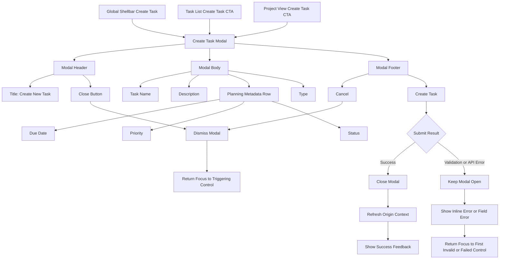
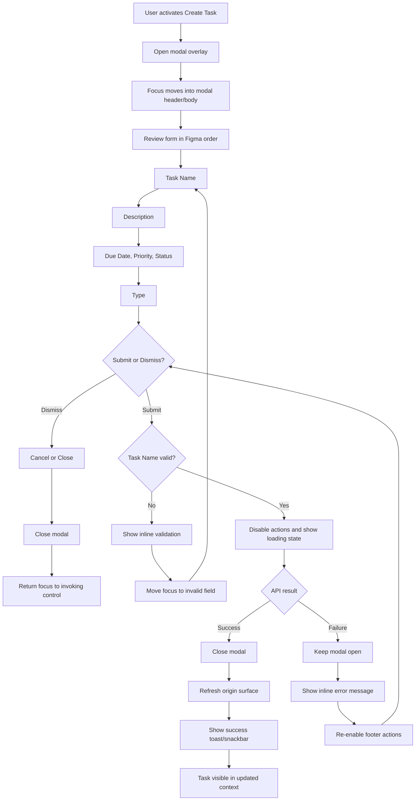
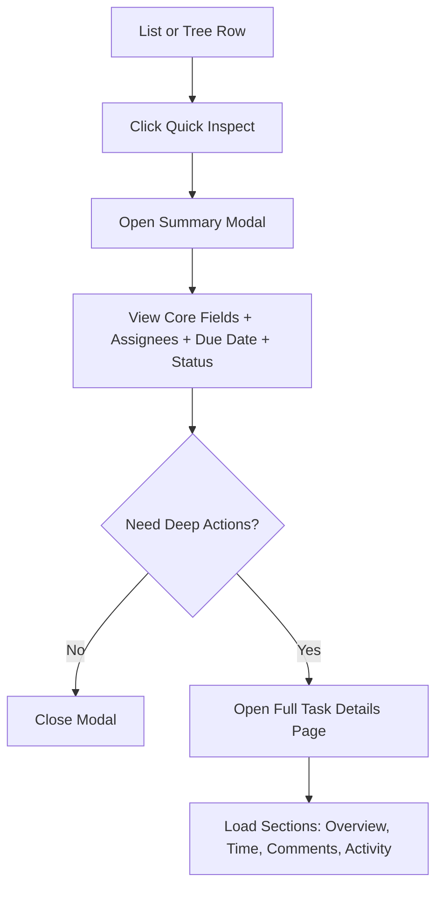
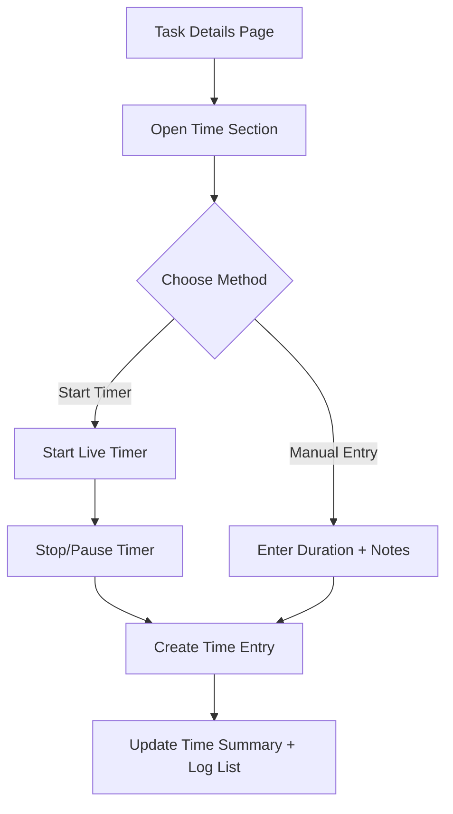
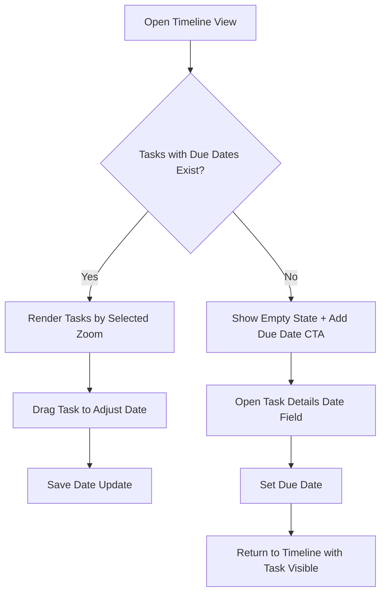

# TaskFlow UI/UX Specification

## Introduction

This document defines the user experience goals, information architecture, user flows, and visual design specifications for TaskFlow's user interface. It serves as the foundation for visual design and frontend development, ensuring a cohesive and user-centered experience.

This revision adds a focused specification for refactoring the Create Task modal to align with approved Figma design node 170:144 while preserving the existing create-task workflow and backend contract.

### Overall UX Goals & Principles

The current refinement scope centers on the Create Task modal experience, which needs to preserve existing behavior while adopting the approved Figma hierarchy, spacing, field grouping, and action emphasis.

#### Target User Personas

- **Freelance Sarah (Primary):** Independent consultant managing multiple client tasks, billing by time, needs low-friction task capture plus reliable timer plus fast list filtering.
- **Team Lead Marcus (Primary):** Leads a 3-7 person team, needs hierarchy visibility, assignment clarity, timeline planning, and status transparency.
- **Occasional Collaborator (Secondary):** Team member who updates assigned work quickly and values clear status updates, due-date visibility, and minimal navigation overhead.

#### Usability Goals

- Users can create a standard task in under 30 seconds from list, project, or global create entry points.
- The modal communicates a clear information hierarchy: task identity first, planning metadata second, action choices last.
- Users can complete the form entirely by keyboard with visible focus states and no ambiguous controls.
- Validation and API failure states are shown in place without collapsing layout or obscuring the primary action.
- The refactored modal preserves current functionality while reducing visual mismatch between shipped UI and the approved Figma design.

#### Design Principles

1. **Clarity through grouping** - mirror the Figma structure of header, form body, and action footer so scanning order is obvious.
2. **Primary action emphasis** - "Create Task" must read as the dominant action, with Cancel clearly secondary and visually quieter.
3. **Progressive commitment** - require only the task name, while allowing metadata completion without making the form feel heavy.
4. **Consistency with intent** - align spacing, typography, control sizing, and button treatment with the Figma modal rather than default Angular Material presentation.
5. **Accessible confidence** - every field, state, and action should remain understandable under keyboard, screen reader, error, and smaller-screen use.

### Change Log

| Date | Version | Description | Author |
|------|---------|-------------|--------|
| 2026-03-29 | v0.2 | Added Create Task modal refactor specification aligned to Figma node 170:144 | Sally (UX Expert) |
| 2026-02-22 | v0.1 | Initial UI/UX specification draft created | Sally (UX Expert) |

## Information Architecture (IA)

### Site Map / Screen Inventory

```mermaid
graph TD
	A[Global Shellbar Create Task] --> D[Create Task Modal]
	B[Task List Create Task CTA] --> D
	C[Project View Create Task CTA] --> D

	D --> E[Modal Header]
	E --> E1[Title: Create New Task]
	E --> E2[Close Button]

	D --> F[Modal Body]
	F --> F1[Task Name]
	F --> F2[Description]
	F --> F3[Planning Metadata Row]
	F3 --> F31[Due Date]
	F3 --> F32[Priority]
	F3 --> F33[Status]
	F --> F4[Type]

	D --> G[Modal Footer]
	G --> G1[Cancel]
	G --> G2[Create Task]

	G2 --> H{Submit Result}
	H -->|Success| I[Close Modal]
	I --> J[Refresh Origin Context]
	J --> K[Show Success Feedback]

	H -->|Validation or API Error| L[Keep Modal Open]
	L --> M[Show Inline Error or Field Error]
	M --> N[Return Focus to First Invalid or Failed Control]

	G1 --> O[Dismiss Modal]
	E2 --> O
	O --> P[Return Focus to Triggering Control]
```

### Navigation Structure

**Primary Navigation:**  
Create Task remains a modal overlay launched from three existing entry points: the global shellbar action, the task list header CTA, and the project-level create action. The modal should not introduce a new route for this refactor.

**Secondary Navigation:**  
Inside the modal, navigation is linear and task-oriented: header dismissal controls, form fields in visual order, then footer actions. The form body follows the Figma grouping pattern: Task Name, Description, a three-column planning row for Due Date, Priority, and Status, then Type.

**Breadcrumb Strategy:**  
No breadcrumb is shown inside the modal. Context should be preserved by keeping the user in their originating surface and restoring focus to the triggering control on cancel, close, or successful completion.

## User Flows

### Create Task Modal Refactor

**User Goal:** Create a new task quickly from any current entry point using a modal that matches the approved Figma layout and interaction hierarchy.  
**Entry Points:** Global shellbar Create Task action, task list header CTA, project-level Create Task action.  
**Success Criteria:** The modal opens in-place, the user completes at least the required Task Name field, submission succeeds without page navigation, the modal closes, focus returns appropriately, and the originating view refreshes with success feedback.

```mermaid
graph TD
	A[User activates Create Task] --> B[Open modal overlay]
	B --> C[Focus moves into modal header/body]
	C --> D[Review form in Figma order]
	D --> D1[Task Name]
	D1 --> D2[Description]
	D2 --> D3[Due Date, Priority, Status]
	D3 --> D4[Type]
	D4 --> E{Submit or Dismiss?}

	E -->|Dismiss| F[Cancel or Close]
	F --> G[Close modal]
	G --> H[Return focus to invoking control]

	E -->|Submit| I{Task Name valid?}
	I -->|No| J[Show inline validation]
	J --> K[Move focus to invalid field]
	K --> D1

	I -->|Yes| L[Disable actions and show loading state]
	L --> M{API result}
	M -->|Success| N[Close modal]
	N --> O[Refresh origin surface]
	O --> P[Show success toast/snackbar]
	P --> Q[Task visible in updated context]

	M -->|Failure| R[Keep modal open]
	R --> S[Show inline error message]
	S --> T[Re-enable footer actions]
	T --> E
```

**Edge Cases & Error Handling:**
- Escape closes the modal only when the form is not in a blocked submitting state, then returns focus to the opener.
- Cancel and close-icon behavior are equivalent in outcome, but both must remain visually secondary to the Create Task button.
- Required-field validation appears inline without shifting the footer off-screen or hiding the primary action.
- API failure keeps all entered values intact so the user can retry without re-entering the form.
- Double submission is prevented by disabling both footer actions during the pending state.
- On narrower screens, the three-column planning row can collapse vertically, but field order must remain consistent with desktop.

**Notes:** This flow intentionally keeps the current application behavior of modal-based creation and immediate in-context refresh, while refining layout, focus order, and visual emphasis to match Figma node 170:144.

### Quick Inspect Modal to Full Details Page

**User Goal:** Inspect task summary quickly, then escalate to full details when needed.  
**Entry Points:** Eye icon / row action from list or tree.  
**Success Criteria:** Users can read key info in modal and open full task page in one action.

```mermaid
graph TD
	A[List or Tree Row] --> B[Click Quick Inspect]
	B --> C[Open Summary Modal]
	C --> D[View Core Fields + Assignees + Due Date + Status]
	D --> E{Need Deep Actions?}
	E -- No --> F[Close Modal]
	E -- Yes --> G[Open Full Task Details Page]
	G --> H[Load Sections: Overview, Time, Comments, Activity]
```

**Edge Cases & Error Handling:**
- Partial load failure (e.g., comments) shows section-level error with retry.
- Modal content loading skeleton prevents blank flash.
- Escape key closes modal and returns focus to originating row action.

**Notes:** Modal is intentionally non-comprehensive; no deep editing inside modal.

### Manage Time from Task Details Page

**User Goal:** Start/stop timer or add manual log without leaving task context.  
**Entry Points:** Task Details page Time section, optional quick action in list row.  
**Success Criteria:** Time entry is recorded, reflected in task totals, and visible in log history.

```mermaid
graph TD
	A[Task Details Page] --> B[Open Time Section]
	B --> C{Choose Method}
	C -- Start Timer --> D[Start Live Timer]
	D --> E[Stop/Pause Timer]
	E --> F[Create Time Entry]
	C -- Manual Entry --> G[Enter Duration + Notes]
	G --> F
	F --> H[Update Time Summary + Log List]
```

**Edge Cases & Error Handling:**
- Lost connection while timer running triggers reconnect notice and local elapsed preservation.
- Invalid manual duration blocked with clear validation.
- Concurrent timer conflict warns user and offers switch/stop options.

**Notes:** Keep timer controls persistent and high visibility in details page layout.

### Timeline Planning and Empty-State Recovery

**User Goal:** Plan work by date and quickly understand missing scheduling data.  
**Entry Points:** Timeline tab with Day/Week/Month toggles.  
**Success Criteria:** Dated tasks render correctly; empty state gives direct action.

```mermaid
graph TD
	A[Open Timeline View] --> B{Tasks with Due Dates Exist?}
	B -- Yes --> C[Render Tasks by Selected Zoom]
	C --> D[Drag Task to Adjust Date]
	D --> E[Save Date Update]
	B -- No --> F[Show Empty State + Add Due Date CTA]
	F --> G[Open Task Details Date Field]
	G --> H[Set Due Date]
	H --> I[Return to Timeline with Task Visible]
```

**Edge Cases & Error Handling:**
- Date update conflict resolved with latest-server-value prompt.
- Invalid date ranges blocked with explanation.
- Timeline render timeout shows fallback guidance and retry.

**Notes:** Empty-state CTA is mandatory to prevent dead-end experience.

## Wireframes & Mockups

**Primary Design Files:** Approved source of truth is the local Figma design for the Create Task modal at node 170:144 ("Modal Content"), including its child frames for Header (170:145), Body/Form (170:154), and Footer (170:226).

### Key Screen Layouts

#### Create Task Modal

**Purpose:** Provide a focused, high-confidence task creation surface that preserves current application behavior while matching the approved Figma composition.

**Key Elements:**
- Framed modal container at 672px width with 8px radius, white surface, subtle border, and elevated shadow.
- Header band with left-aligned title "Create New Task" and a top-right close affordance, separated from the body by a divider.
- Form body with 32px horizontal padding and 24px vertical rhythm: Task Name, Description, a three-column row for Due Date, Priority, and Status, then a full-width Type field.
- Footer band with a muted background, top divider, secondary Cancel button, and dominant blue Create Task button aligned right.

**Interaction Notes:** The modal should preserve current create-task functionality, but its visual hierarchy must follow the Figma layout exactly: strong section boundaries, grouped planning fields, and footer-based action emphasis. Validation and API errors remain inside the modal and must not break the footer alignment.

**Design File Reference:** Figma local node 170:144, with supporting structure from nodes 170:145, 170:154, and 170:226.

#### Create Task Modal, Tablet/Mobile Adaptation

**Purpose:** Preserve the same creation workflow on narrower screens without losing field clarity or action discoverability.

**Key Elements:**
- Modal width scales to viewport with safe margins while maintaining header/body/footer separation.
- Three-column planning row collapses into a vertical stack in the same field order: Due Date, Priority, Status.
- Footer actions remain visible and readable, with the primary Create Task button retaining stronger emphasis than Cancel.

**Interaction Notes:** Responsive collapse should not change validation logic, tab order, or action semantics. The mobile/tablet version is an adaptation of the same modal, not a different flow.

**Design File Reference:** Derived responsive behavior from Figma node 170:144; explicit mobile frame still needs to be added if the team wants pixel-perfect breakpoint variants.

## Component Library / Design System

**Design System Approach:** Reuse the existing Angular Material form foundation and TaskFlow token system, but override layout, spacing, typography, and footer action treatment so the Create Task modal matches the approved Figma composition instead of default Material dialog presentation.

### Core Components

#### Create Task Modal Shell

**Purpose:** Provide the structural container for the refactored create flow.

**Variants:** Standard desktop modal, responsive modal for tablet/mobile.

**States:** Default, opening, submitting, error, closing.

**Usage Guidelines:** Keep the shell visually divided into header, body, and footer regions. Width targets 672px on desktop with viewport-based scaling on smaller screens. Surface styling should match the Figma card treatment: white background, subtle border, 8px radius, and elevated shadow.

#### Modal Header

**Purpose:** Orient the user and provide a reliable close affordance.

**Variants:** Create mode only for current scope.

**States:** Default, close-button hover/focus, disabled-close during blocking submit if required by engineering choice.

**Usage Guidelines:** Left-align the title "Create New Task," keep the close control top-right, and preserve the bottom divider. Header padding should follow the Figma structure: 32px horizontal and 20px vertical.

#### Text Input Field

**Purpose:** Collect core task identity and freeform task details.

**Variants:** Single-line required text input for Task Name, multiline textarea for Description.

**States:** Default, hover, focus, filled, invalid, disabled, submitting.

**Usage Guidelines:** Task Name is the primary field and must appear first. Labels stay visible above the field rather than relying on placeholder-only behavior. Validation must be inline and associated with the field without disturbing the footer layout.

#### Planning Metadata Row

**Purpose:** Group task-planning controls into a single, scan-friendly unit.

**Variants:** Three-column desktop row, vertically stacked responsive layout.

**States:** Default, partially filled, fully filled, invalid child field, disabled/submitting.

**Usage Guidelines:** Preserve the Figma order exactly: Due Date, Priority, Status. On smaller screens, stack in the same order rather than reordering by implementation convenience.

#### Select Controls

**Purpose:** Capture categorical task metadata.

**Variants:** Priority select, Status select, Type select.

**States:** Default, hover, focus, expanded, selected, invalid, disabled.

**Usage Guidelines:** Due Date, Priority, and Status appear in the grouped planning row; Type remains full-width beneath that row. Select visual treatment should feel consistent across all three controls even if implementation mixes datepicker and select primitives internally.

#### Modal Footer Actions

**Purpose:** Give the user an unambiguous choice between dismissing and committing the form.

**Variants:** Secondary Cancel button, primary Create Task button.

**States:** Default, hover, focus, pressed, disabled, loading.

**Usage Guidelines:** Footer background and divider should visually separate actions from the form. Cancel remains visually quieter. Create Task carries primary emphasis with the approved blue fill and stronger label weight. Both actions disable during submission to prevent duplicate requests.

#### Inline Error Feedback

**Purpose:** Explain validation and API failures without ejecting the user from the modal.

**Variants:** Field-level validation error, form-level submission error.

**States:** Hidden, visible, updated after retry.

**Usage Guidelines:** Field-level errors stay attached to their input. Submission error appears within the body region above or near the form content, not as a replacement for the footer or as the only feedback in an external toast.

## Branding & Style Guide

### Visual Identity

**Brand Guidelines:** The Create Task modal should adopt the approved Figma visual language as a scoped refinement, not a full application rebrand. The goal is to move this workflow away from a generic Angular Material dialog and toward a cleaner, more product-specific productivity surface: calm white container, restrained borders, clearer sectioning, stronger CTA emphasis, and Manrope-based typography inside the modal. Existing shell-level branding, snackbar semantics, and motion tokens can remain intact outside this scope.

### Color Palette

| Color Type | Hex Code | Usage |
|---|---|---|
| Primary | #137FEC | Primary Create Task button, active emphasis, high-importance interactive states |
| Secondary | #64748B | Cancel text, close affordance, supporting text, lower-emphasis controls |
| Accent | #F6F7F8 | Footer background, section separation, subtle surface contrast |
| Success | #2E7D32 | Positive feedback, success snackbar, confirmation states |
| Warning | #ED6C02 | Cautionary notices, non-blocking attention states |
| Error | #C62828 | Validation failures, submission errors, destructive or blocked states |
| Neutral | #FFFFFF / #E2E8F0 / #111418 | Modal surface, borders/dividers, primary text |

### Typography

#### Font Families

- **Primary:** Manrope, "Segoe UI", Roboto, sans-serif
- **Secondary:** Roboto, "Helvetica Neue", Arial, sans-serif
- **Monospace:** ui-monospace, SFMono-Regular, Consolas, monospace

#### Type Scale

| Element | Size | Weight | Line Height |
|---|---|---|---|
| H1 | 32px | 700 | 40px |
| H2 | 18px | 700 | 28px |
| H3 | 16px | 600 | 24px |
| Body | 14px | 400 | 20px |
| Small | 12px | 500 | 18px |

### Iconography

**Icon Library:** Material icons or the existing app icon set may be used, but the modal itself should stay sparse and rely primarily on text labels. The only required icon in this scope is the close affordance in the header.

**Usage Guidelines:** Prefer simple, low-noise iconography. The close icon should read as a utility control, not as a competing action. Do not introduce decorative icons into form fields unless they serve a clear usability purpose.

### Spacing & Layout

**Grid System:** Single-column modal form with one responsive three-column row for Due Date, Priority, and Status on desktop; the same row collapses to a single column on smaller screens.

**Spacing Scale:** 6, 8, 12, 20, 24, 32 px. Use 32px horizontal padding for modal shell regions, 24px vertical spacing between major form groups, 20px vertical padding in header/footer, and approximately 6-8px label-to-field spacing.

## Accessibility Requirements

### Compliance Target

**Standard:** WCAG 2.2 AA for the full Create Task modal flow, including open, fill, validate, submit, error recovery, and close states.

### Key Requirements

**Visual:**
- Color contrast ratios: minimum 4.5:1 for labels, input text, helper/error text, and button text; minimum 3:1 for field boundaries, dividers, focus indicators, and disabled-state affordances that still need to remain perceivable.
- Focus indicators: every interactive element in the modal must show a consistent, high-contrast visible focus ring; focus styling cannot rely on browser defaults being preserved by accident.
- Text sizing: the modal must remain usable at 200% zoom without clipped footer actions, overlapping fields, or inaccessible off-screen validation messages.

**Interaction:**
- Keyboard navigation: focus enters the modal on open, proceeds in visual order, supports Enter/Space activation where applicable, and returns to the invoking control on close or successful completion.
- Screen reader support: the modal must expose a clear dialog name ("Create New Task"), descriptive field labels, required-state announcement for Task Name, and accessible association between each field and its error/help text.
- Touch targets: close, cancel, datepicker trigger, select triggers, and primary submit controls must meet a minimum 44x44px target on touch devices.

**Content:**
- Alternative text: no decorative imagery is required in this modal; any icon-only close affordance must have an accessible name.
- Heading structure: modal title should act as the primary accessible heading for the dialog content and should not be duplicated with competing headings inside the body.
- Form labels: every field must use persistent visible labels above the input, not placeholder-only labeling; validation messaging must be programmatically tied to the field.

### Testing Strategy

- Add automated accessibility checks for the create-task modal open state, invalid submission state, and API-error state.
- Run keyboard-only validation of open, tab sequence, select/date interactions, submit, Escape close, and focus return.
- Perform screen reader spot checks on Windows with NVDA for dialog announcement, label reading, required-state announcement, and error-message association.
- Verify responsive accessibility at mobile widths, especially touch-target sizing and footer action reachability.

## Responsiveness Strategy

### Breakpoints

| Breakpoint | Min Width | Max Width | Target Devices |
|---|---:|---:|---|
| Mobile | 320px | 767px | Phones in portrait and landscape |
| Tablet | 768px | 1199px | Tablets and small laptops |
| Desktop | 1200px | 1599px | Standard desktop and laptop usage |
| Wide | 1600px | - | Large monitors where the modal still remains width-constrained |

### Adaptation Patterns

**Layout Changes:** The modal uses a fixed-design target of 672px on desktop, but scales down to fit the viewport with safe outer margins on smaller screens. Header, body, and footer remain visually distinct at all breakpoints. The three-column planning row collapses from three equal columns into a vertical stack on tablet and mobile.

**Navigation Changes:** No navigation model changes by breakpoint. The same modal entry points remain in place, and the same close, cancel, and submit actions remain available. The close affordance stays in the header; primary and secondary actions stay in the footer.

**Content Priority:** Task Name and Description remain first. Due Date, Priority, and Status stay grouped conceptually even when stacked. Type remains below planning metadata. Error feedback must stay near the related field or form region without pushing the primary CTA out of view.

**Interaction Changes:** On touch devices, all tappable controls must meet minimum target sizes, select/date interactions must remain usable without hover dependency, and footer buttons should remain easily reachable without requiring horizontal scrolling or clipped overflow.

## Animation & Micro-interactions

### Motion Principles

- Motion should reinforce modal structure and state changes, not compete with form completion.
- All transitions should feel fast, quiet, and consistent with the existing dialog motion tokens already present in the app.
- Feedback motion should prioritize clarity for open, close, validation, loading, and success states.
- Reduced-motion preferences must disable non-essential movement while preserving state visibility.

### Key Animations

- **Create Task modal enter:** Slight scale-up plus fade on open to reinforce focus shift into the dialog. (Duration: 160ms, Easing: cubic-bezier(0.2, 0, 0, 1))
- **Create Task modal exit:** Fast fade on close, cancel, and successful submission completion. (Duration: 120ms, Easing: ease-out)
- **Field focus transition:** Subtle border and label emphasis change when an input gains focus. (Duration: 120ms, Easing: ease-out)
- **Inline validation reveal:** Error text and invalid field styling appear with a quick opacity transition, without large layout jumps. (Duration: 120ms, Easing: ease-out)
- **Primary button loading state:** The Create Task button swaps label-to-loading state without shifting surrounding footer alignment. (Duration: 120ms, Easing: ease-out)
- **Form-level error feedback:** Submission error container fades in within the form body after failed API response. (Duration: 120ms, Easing: ease-out)
- **Success feedback handoff:** After successful creation, modal closes first and success snackbar enters immediately after so the user perceives one continuous completion sequence. (Modal exit: 120ms, Snackbar enter: 180ms)

## Performance Considerations

### Performance Goals

- **Modal Open:** Perceived open transition completes in under 200ms after trigger activation.
- **Interaction Response:** Field focus, typing, select opening, and validation feedback respond within 100ms.
- **Animation FPS:** Modal open/close, focus transitions, and feedback states target 60 FPS on standard desktop and mobile hardware.

### Design Strategies

- Keep the modal form fully local and lightweight so open state does not depend on additional async data loading.
- Preserve entered form values on submission failure to avoid costly re-entry and perceived instability.
- Use transform and opacity for open/close and feedback transitions rather than layout-heavy animation.
- Avoid excessive shadow, blur, or nested animation that would make the modal feel sluggish on lower-end devices.
- Ensure loading indicators inside the primary button do not cause footer reflow or button-width jitter.
- Keep responsive collapse simple by stacking the three-column row rather than introducing complex breakpoint-specific rearrangements.

## Next Steps

### Immediate Actions

1. Review this modal refactor specification with product and frontend engineering to confirm Figma node 170:144 is the implementation source of truth.
2. Create an implementation story for the Angular Create Task modal covering layout refactor, typography, footer actions, and grouped metadata row behavior.
3. Add a design QA pass comparing the implemented modal against Figma node 170:144 across desktop and mobile widths.
4. Validate accessibility behavior for dialog announcement, focus order, error association, and focus return.
5. Decide whether Manrope should be scoped only to the modal or promoted into a wider design-system update later.

### Design Handoff Checklist

- [x] Modal layout mapped to approved Figma node
- [x] Component inventory complete
- [x] Accessibility requirements defined
- [x] Responsive behavior documented
- [x] Visual styling guidance aligned to Figma
- [x] Performance and motion guidance established

## Checklist Results

No standalone UI/UX checklist file was identified in the current BMAD dependencies during this run. Recommend running the project checklist workflow once a dedicated UX checklist artifact is added.

